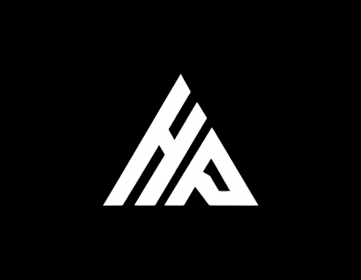
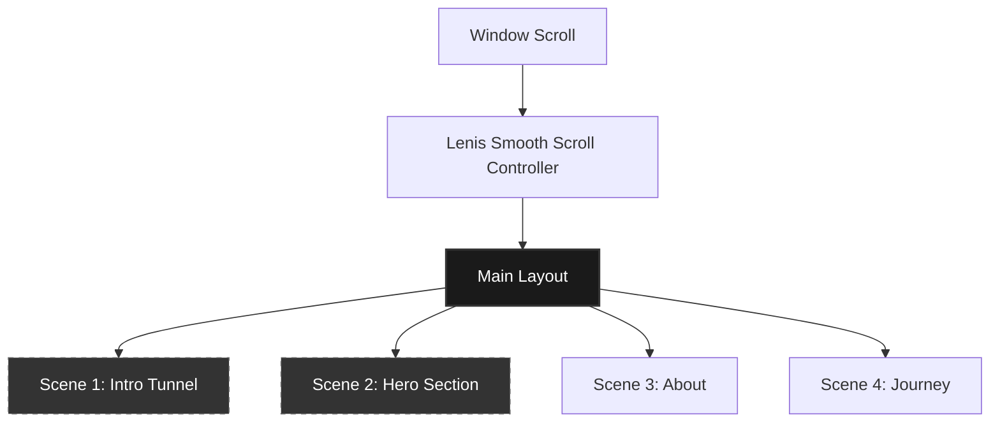

<p align="center">
  
</p>

<h1 align="center">✨ Hemanth Ande — Interactive Portfolio ✨</h1>

<p align="center">
  <strong>An immersive, high-performance, and beautifully crafted personal portfolio.</strong>
</p>

<p align="center">
  <a href="https://hemu-29.github.io/My-Portfolio/" target="_blank">
    
  </a>
</p>

<p align="center">
  
  
  
  
  
  
</p>

---

## 📖 Overview

Welcome to the source code of my personal portfolio. Designed to bridge **cutting-edge web engineering** with **cinematic visual design**, this site features fluid animations, interactive 3D elements, and a unique page-stacking scroll architecture.

> [!TIP]
> **View it live:** Click the [Live Demo Badge](https://hemu-29.github.io/My-Portfolio/) above or visit the deployment directly at [https://hemu-29.github.io/My-Portfolio/](https://hemu-29.github.io/My-Portfolio/).

---

## 🛠️ The Tech Stack

| Component | Choice | Rationale / Implementation |
| :--- | :--- | :--- |
| **Framework** | Next.js 16 (App Router) | High-performance Server-Side Generation (SSG) & Static Exports. |
| **Language** | TypeScript | Strong typing for configuration, scenes, and structures. |
| **3D Engine** | Three.js | Powering the interactive intro gallery tunnel & journey light cables. |
| **Animations** | GSAP + ScrollTrigger | Fluid, scroll-linked micro-animations with strict performance constraints. |
| **Smooth Scrolling** | Lenis | Unified `requestAnimationFrame` loop (`lib/lenis.ts`) to avoid scroll-jacking. |
| **Styling** | CSS Modules (Vanilla CSS) | Clean, scoped styling with central design tokens in `app/globals.css`. |
| **i18n** | EN / FR React Context | Zero-dependency React state (`lib/i18n.tsx`) that persists through scene transitions. |

---

## 🎬 Scroll & Scene Architecture

Instead of scrolling down a traditional long page, this portfolio uses a **stacked sticky frame system**.



### The Stack Scroll Model
Each scene consists of:
1. **A Sticky Hold (`100svh`)**: Pinned viewport containing the active interactive frame.
2. **A Runway Sibling**: A spacer element beneath it that dictates the scroll height of that scene.

As you scroll, the scroll progress is calculated from the runway (via `lib/scene.ts`) and fed into GSAP. This allows the active scene to stay pinned while the incoming scene rises from the bottom to seamlessly cover it.

---

## 📂 Project Structure

```bash
├── app/                  # Layout, scene stack (page.tsx), Case Study routes
├── components/
│   ├── lab/              # Experimental playground components
│   ├── layout/           # Global components (Nav, Scene, Scroll, Language)
│   ├── sections/         # Visual sections (Hero, About, Journey, Work, etc.)
│   └── ui/               # Shared interactive primitives (Button, Marquee)
├── content/              # Strictly typed data sources (Certifications, Experience, Projects)
├── lib/                  # GSAP helpers, Lenis loop, i18n store, scene progress logic
└── public/               # Optimized assets, images, and brand logos
```

---

## 🚀 Running Locally

Follow these steps to run the portfolio on your local machine:

1. **Clone the repository:**
   ```bash
   git clone https://github.com/Hemu-29/My-Portfolio.git
   cd My-Portfolio
   ```

2. **Install dependencies:**
   ```bash
   npm install
   ```

3. **Start the development server:**
   ```bash
   npm run dev
   ```
   Open [http://localhost:3000](http://localhost:3000) to see it in action.

4. **Build and Export (Static Production):**
   ```bash
   npm run build
   ```
   This generates static pages inside the `out/` directory, optimized for deployment.

---

## 📐 Design & Motion Conventions

- **Performance-First Animations**: Only animate CSS properties that trigger Composite (i.e. `transform` and `opacity`).
- **Accessibility & Reduced Motion**: Every motion-heavy section respects the `prefers-reduced-motion` media query and automatically falls back to a beautiful, readable static layout.
- **Aspect Ratio Integrity**: Photographs and brand marks are rendered at true aspect ratios using `object-fit: cover` to avoid clipping or distortion.
- **Locales & i18n**: Support for English and French. Brand names and proper nouns are preserved in their native forms without translation.

---

<p align="center">
  Developed with ❤️ by <a href="https://github.com/Hemu-29">Hemanth Ande</a>
</p>
